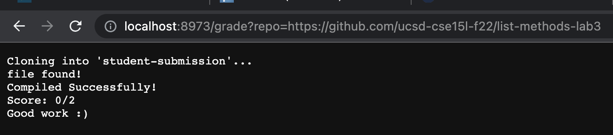
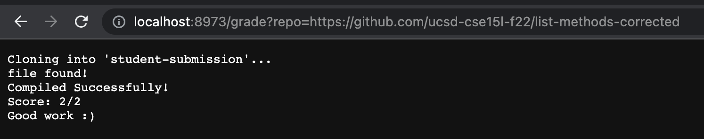
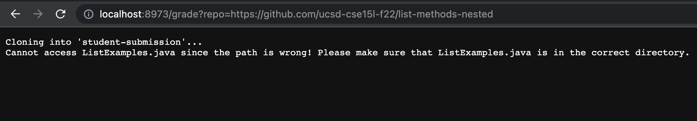

# Lab Report 5


## grade.sh
```
CP=".:../lib/hamcrest-core-1.3.jar:../lib/junit-4.13.2.jar"

rm -rf student-submission
git clone $1 student-submission

cd student-submission

if [ -f "ListExamples.java" ]
then
    echo "file found!"
else
    find . -name ListExamples.java > find-results.txt
    if [ -s find-results.txt ]
    then
        echo "Cannot access ListExamples.java since the path is wrong! Please make sure that ListExamples.java is in the correct directory."
    else
        echo "file does not exist!"
    fi
    exit
fi

cd ..
cp TestListExamples.java student-submission

cd student-submission
javac -cp $CP *.java 2> errors_output.txt

if [ $? -eq 0 ]
then
    echo "Compiled Successfully!"
else
    echo "The code does not compile. Please fix the compilation errors below:"
    cat errors_output.txt
    exit
fi


java -cp $CP org.junit.runner.JUnitCore TestListExamples > tests.txt 

AllTestsPass= grep -h "tests" tests.txt > output_success.txt
TestsFailed= grep -h "Failures: 1" tests.txt > output_failure.txt

if [ -s output_success.txt ]
then
    echo "Score: 2/2"
elif [ -s output_failure.txt ]
then
    echo "Score: 1/2"
else
    echo "Score: 0/2"
fi

echo "Good work :)"
exit
```


## Screenshots

- Lab 3 incorrect implementation


- Correct implementation


- Correct implementation saved in a nested directory pa1.



## Tracing Screenshot #3

1. The variable **CP** is created and assigned the String which would be used for compiling and running the tests in bash (specifically for mac).
2. **rm -rf student-submission** We delete the current student-submission repository if there is one. No *standard output* and no *standard error*. 
3. **git clone $1 student-submission** We clone the repository that is given as an input by the user (i.e. the link that we put in the query) and name it student-submission. No *standard output*, *standard error* is:
```
Cloning into 'student-submission'...
```
4. We use cd in order to make sure that our current working directory is student-submission (which is the repository above).
5. **if \[ -f "ListExamples.java" \]** we use the bash command **-f** to search for the file ListExamples.java in our current working directory (student-submission).
6. The if-statement in 5 is evauated to false because we know that ListExamples.java is not directly under student-submission. Thus, the user does not recieve the ourput "file found!"
7. The else clause is evaluated.
8.  **find . -name ListExamples.java > find-results.txt** This command uses the bash **find** command to see whether the ListExamples.java file is somewhere inside the repository we cloned. The **.** tells the program to look for the file "ListExamples.java" anywhere in the repository we cloned rather than specifically under student-submission. This command would return the paths (if any exist) to all files that have a name which includes "ListExamples.java". We use > to store any such paths in the text file find-results.txt.
The *standard output* is:
```
./pa1/ListExamples.java
```
There is no *standard error*.
9.  We use a nested if-else statement to decide on the best output to return.
10. **if \[ -s find-results.txt \]** this if statement returns true if the find-results.txt exists and is not empty, and false otherwise. Since in our case there exists a path to ListExamples.java, find-results.txt is not empty and the if statement is true.
11. We use the bash **echo** command to inform the user that while our program determined that the file ListExamples.java exists, it was not able to access it because it was given the wrong path (that is, we were looking for it in the wrong directory), and so the user must either move the file ListExamples.java to be under the current working-directory, or change the current working directory to be the one where ListExamples.java is present.
The *standard output* is:
```
Cannot access ListExamples.java since the path is wrong! Please make sure that ListExamples.java is in the correct directory.
```
There is no *standard error*.
12. The else clause for the nested-if statement is only evaluated if ListExamples.java does not exist in the repository we cloned (so find-results.txt is empty), but is not evaluated in this case and therefore does return that the file was not found.
13. We use fi to terminate the nested if statement, and then exit the program since it cannot run the tests without access to the file ListExamples.java, and there is nothing more for it to do that would be of use to the user.
14. We end the outer if-statement with fi

  
